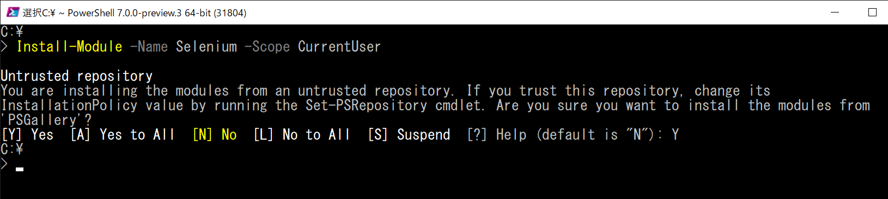
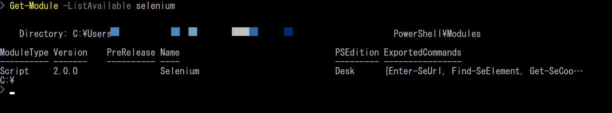
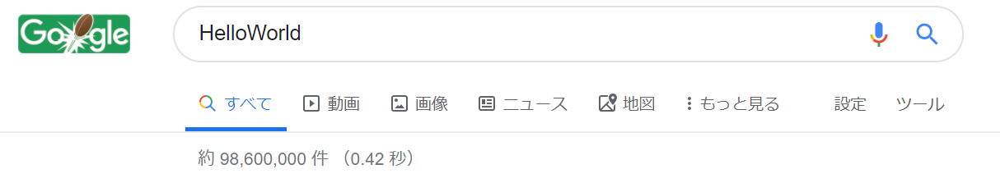
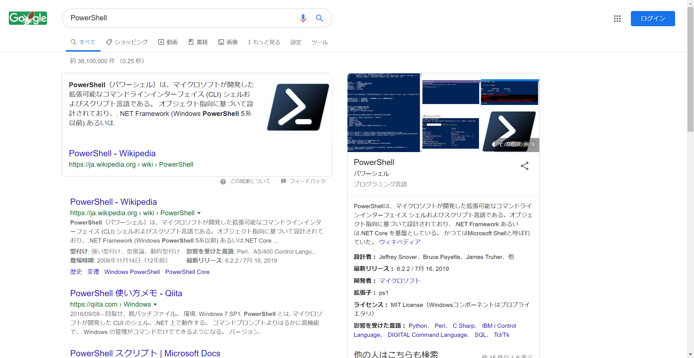
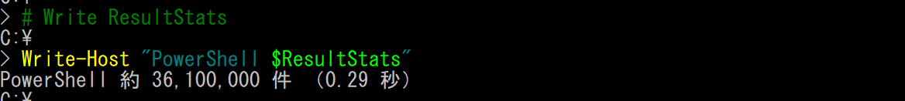

# 🔰Selenium-PowerShellをさわってみる

## 🔰そもそもSeleniumって？

- CIツール
- ブラウザのコントロールができる
- webのUIテスト自動化によく使われているらしい
- 対応言語にPowerShellとは書いてはありませんが、C#用のライブラリがある。　このC#用ライブラリをPowerShellから利用すればPowerShellから利用できます。
- [W3C - WebDriver](https://www.w3.org/TR/webdriver/)。2019年現在としてはW3CとしてWebの標準技術になっていたりして各種ブラウザ側でWebdriverが実装されている

Seleniumの対応環境等は下記参照。

[SeleniumHQ - Platforms Supported by Selenium](https://www.seleniumhq.org/about/platforms.jsp#browsers)

## 🔰Selenium-PowerShellって？

SeleniumのC＃WebDriverをPowerShellから利用しやすくするためにラッピングしてくれるモジュール。

PowerShellからSeleniumを取り扱おうとすると、これに類するようなモノをがりがりと自前で書いていたかと思いますが。

こちらのモジュールではSeleniumを操作できるコマンドレットが提供されています。

便利。

## 🔰Selenium-PowerShellのリポジトリやら

- [adamdriscoll/selenium-powershell](https://github.com/adamdriscoll/selenium-powershell)
- [PowerShell Gallery - Selenium](https://www.powershellgallery.com/packages/Selenium)

インストール方法や利用方法については、下記を見ればOK。

[selenium-powershell/README.md](https://github.com/adamdriscoll/selenium-powershell/blob/master/README.md)


## 🔰Selenium-PowerShellをインストールしてさわってみる

### 🔰Selenium-PowerShellをインストール

Install-ModuleでPowerShellModuleをインストールします。下記の例ではなんとなくScopeをCurrentUserを選択していますがここらへんはお好みで。

```
# インストール（scopeがCurrentUserの場合）
Install-Module -Name Selenium -Scope CurrentUser
# インストール先を確認
Get-Module -ListAvailable selenium
ｔ# モジュールが提供するコマンドレットを確認
Get-Command -Module selenium
```





### 🔰Chromeブラウザを操作してみる

[Start a Browser Driver](https://github.com/adamdriscoll/selenium-powershell/blob/master/README.md#start-a-browser-driver)

今回は下記のコードを実行して、Chromeを操作してみる。

```
# To start a Chrome Driver
$Driver = Start-SeChrome -Maximized

# Navigate to a URL
Enter-SeUrl https://www.google.co.jp/ -Driver $Driver

# Find an Element
$Element = Find-SeElement -Driver $Driver -Name "q"

# Send Keystrokes
Send-SeKeys -Element $Element -Keys "HelloWorld"

# Submit
$Element.Submit()

```

実行すると、Chromeが起動して検索ボックスにHelloWorldと入力して検索を実行されます。



### 🔰スクリーンショットを取得してみる

Selenium-PowerShellではブラウザのスクリーンショットを取得するために下記コマンドレットが用意されています。
これらを用いてスクリーンショットを取得してみます。
※エラーをトラップした際にスクリーンショットを取得する等、かなり便利に利用できるコマンド。便利

- Invoke-SeScreenshot
- Save-SeScreenshot

今回はGoogleでPowerShellと検索した結果を、`c:\temp\selenium-powershell-screenshots.png`に保存してみます。

```
# To start a Chrome Driver
$Driver = Start-SeChrome -Maximized

# Navigate to a URL
Enter-SeUrl https://www.google.co.jp/ -Driver $Driver

# Find an Element(Xpath)
$Element = Find-SeElement -Driver $Driver -XPath "//input[@name='q']"

# Send Keystrokes
Send-SeKeys -Element $Element -Keys "PowerShell"

# Submit
$Element.Submit()

# Invoke ScreenShot
$Screenshot = Invoke-SeScreenshot -Driver $Driver

# Save ScreenShot
Save-SeScreenshot -Screenshot $Screenshot -Path "c:\temp\selenium-powershell-screenshots.png"

# Browser quit
Stop-SeDriver -Driver $Driver
```

取得したスクリーンショット



### 🔰Chromeブラウザを操作してみる（headlessモード）

PowerShellとGoogle検索した件数を出力すうサンプル。

```
# To start a Chrome Driver
$Driver = Start-SeChrome -Headless

# Navigate to a URL
Enter-SeUrl https://www.google.co.jp/ -Driver $Driver

# Find an Element(Xpath)
$Element = Find-SeElement -Driver $Driver -XPath "//input[@name='q']"

# Send Keystrokes
Send-SeKeys -Element $Element -Keys "PowerShell"

# Submit
$Element.Submit()

# get resultStats
$ResultStats = Find-SeElement -Driver $Driver -XPath "//div[@id='resultStats']" | Select-Object -ExpandProperty Text

# Browser quit
Stop-SeDriver -Driver $Driver

# Write ResultStats
Write-Host "PowerShell $ResultStats"

```




## 🔰総評

要素の検索やスクリーンショットやWaitや...を一から書くとそこそこな手間なので、これらを手軽に利用できるコマンドレットが提供されるSelenium-PowerShellはとても便利。
